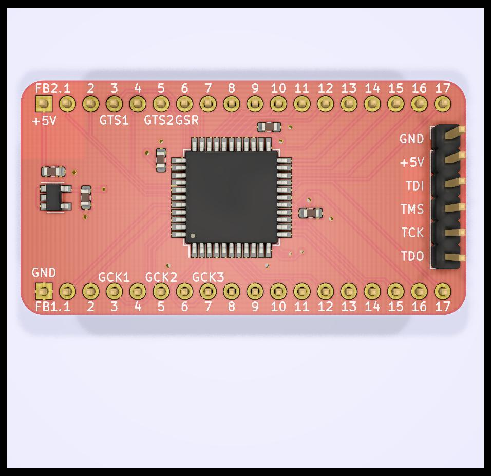
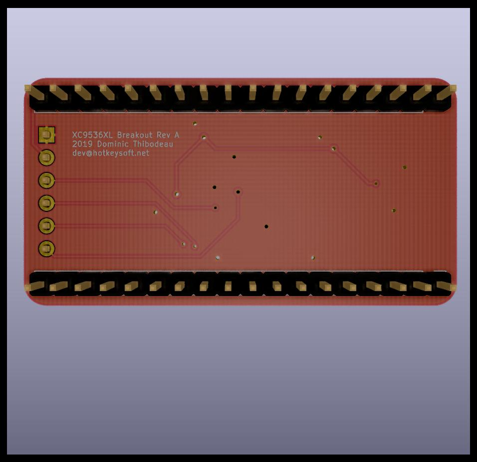
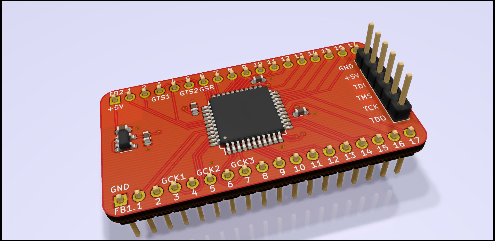

# XC9536XL Breakout Board

Rev A October 2019

XC9536XL CPLD Features
============
- 5 ns pin-to-pin logic delays
- System frequency up to 178 MHz
- 36 macrocells with 800 usable gates
- 5V tolerant I/O pins (accept 5 V, 3.3V, and 2.5V signals)
- 3.3V or 2.5V output capability

[datasheet](https://www.xilinx.com/support/documentation/data_sheets/ds058.pdf)

Breakout Board Features
============
- JTAG Programming Header
- 5V->3.3V Voltage Regulator to power XC9536XL
- XC9536XL is 5V tolerant and, with a 3.3V output, is compatible with in 5V TTL projects.

Images
============
|Front                                                 | Back                                              |
|------------------------------------------------------|---------------------------------------------------|
|||

### Schematics (pdf)
- [Complete schematics](./img/schema.pdf)

### PCB Images (svg)
- [Top](./img/pcb-front.svg)
- [Bottom](./img/pcb-back.svg)
